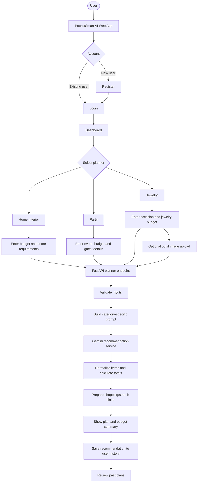
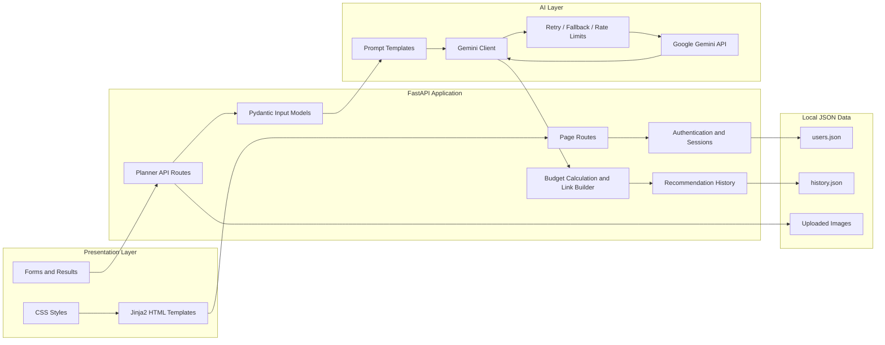
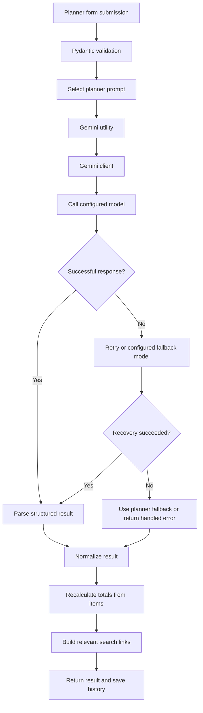

# PocketSmart AI

<p align="center">
  <strong>AI-powered budget planning for everyday decisions</strong>
  <br />
  Plan your space, celebration, and style while keeping your budget in view.
</p>

PocketSmart AI is a web-based budget recommendation application built with FastAPI and Google Gemini. It helps users create plans for **Home Interior**, **Party**, and **Jewelry** needs, review estimated spending, and access relevant shopping or search links. The application also includes user accounts, a dashboard, session handling, and recommendation history.

> **Pricing note:** Generated costs are estimates, not verified live prices or availability. Shopping buttons open platform search pages; they do not guarantee that a suggested item is listed at the displayed estimate.

---

## Contents

- [Why PocketSmart AI?](#why-pocketsmart-ai)
- [Features](#features)
- [Application Workflow](#application-workflow)
- [Architecture](#architecture)
- [Technology Stack](#technology-stack)
- [Repository Structure](#repository-structure)
- [How the AI Recommendation Flow Works](#how-the-ai-recommendation-flow-works)
- [Getting Started](#getting-started)
- [Environment Configuration](#environment-configuration)
- [Run Locally](#run-locally)
- [API Routes](#api-routes)
- [Testing](#testing)
- [Data and Security Notes](#data-and-security-notes)
- [Known Scope and Limitations](#known-scope-and-limitations)
- [Future Enhancements](#future-enhancements)

---

## Why PocketSmart AI?

Planning within a fixed budget often means comparing many products, services, and expense categories. PocketSmart AI brings those planning steps into one interface and uses an AI model to produce a tailored starting plan.

## Features

### 🏡 Home Interior Planner
- Accepts a total budget and room-related requirements.
- Generates itemized interior suggestions.
- Calculates estimated spending and remaining budget.
- Provides shopping search links for supported platforms.

### 🎉 Party Budget Planner
- Accepts event type, budget, guest count, and planning details.
- Produces expense categories and venue suggestions.
- Builds category-aware search links for items and services.
- Displays estimated cost and budget calculations.

### 💎 Jewelry Planner
- Accepts budget, occasion, and jewelry preferences.
- Supports optional outfit image upload for contextual recommendations.
- Returns outfit analysis and jewelry suggestions when image analysis is used.
- Provides relevant shopping search links.

### 👤 Accounts and Personal Planning
- User registration, login, and logout.
- Password hashing and token-based authentication.
- Authenticated dashboard and planner pages.
- Session information and user-specific recommendation history.
- View details of a saved recommendation.

### 🧠 AI and Budget Handling
- Shared Gemini client for planner requests.
- Structured JSON-oriented model responses.
- Retry, fallback-model, timeout, and request-rate handling.
- Normalizes recommendation items and recomputes totals from item prices and quantities.
- Uses a fallback plan if Gemini is unavailable, where supported by the planner logic.
- Reports a budget warning when a generated plan still exceeds the supplied budget.

---

## Application Workflow



## Architecture



---

## Technology Stack

| Component | Technology |
|---|---|
| Language | Python |
| Web framework | FastAPI |
| Server | Uvicorn |
| UI rendering | Jinja2 templates |
| Styling | CSS |
| AI provider | Google Gemini API (`google-genai`) |
| Request validation | Pydantic |
| Authentication | JWT (`python-jose`), bcrypt password hashing |
| Image processing | Pillow |
| Multipart uploads | `python-multipart` |
| Configuration | `python-dotenv` and environment variables |
| Local persistence | JSON files |

---

## Repository Structure

The following reflects the application files present in the supplied project archive. Virtual environments, Git internals, bytecode caches, and generated upload files are intentionally omitted.

```text
Pocketsmart_AI/
├── .env.example
├── .gitignore
├── requirements.txt
├── config.py
├── gemini_client.py
├── prompts.py
├── list_models.py
├── make_sample_image.py
├── test_connection.py
├── samples/
│   └── sample_outfit.png
└── module_2/
    ├── main.py
    ├── auth.py
    ├── models.py
    ├── extras.py
    ├── gemini_utils.py
    ├── test_module2.py
    ├── test_module3.py
    ├── data/
    │   ├── users.json
    │   └── history.json
    ├── static/
    │   ├── styles.css
    │   └── uploads/
    └── templates/
        ├── index.html
        ├── login.html
        ├── register.html
        ├── forgot_password.html
        ├── dashboard.html
        ├── home_planner.html
        ├── party_planner.html
        ├── jewelry_planner.html
        ├── history.html
        ├── info.html
        └── _footer.html
```

### Key files

| File | Purpose |
|---|---|
| `config.py` | Loads Gemini credentials, model settings, generation limits, timeout, and rate-limit configuration |
| `gemini_client.py` | Reusable Gemini integration for text, JSON, and image-plus-text requests, with resilience handling |
| `prompts.py` | Planner-specific prompt templates |
| `module_2/main.py` | FastAPI app, page routes, planner endpoints, sessions, and recommendation history |
| `module_2/auth.py` | Registration, password verification, JWTs, and session management |
| `module_2/models.py` | Pydantic request and user/session data models |
| `module_2/gemini_utils.py` | Planner orchestration, result cleanup, budget calculations, links, and upload handling |
| `module_2/extras.py` | Additional pages and supporting routes |
| `module_2/templates/` | Server-rendered HTML pages |
| `module_2/static/styles.css` | Application styling |
| `module_2/test_module2.py` | Planner and integration tests |
| `module_2/test_module3.py` | Authentication, planner API, session, and history tests |

---

## How the AI Recommendation Flow Works



Budget totals are recalculated from normalized item prices and quantities rather than relying only on model-provided totals. A fallback response is identified in the result so it can be distinguished from a Gemini-generated plan.

---

## Getting Started

### Prerequisites

- Python 3.10+ recommended
- Google Gemini API key
- Git (if cloning the repository)

### 1. Clone the repository

```bash
git clone <repository-url>
cd Pocketsmart_AI
```

Replace `<repository-url>` with your repository's clone URL.

### 2. Create a virtual environment

**Windows PowerShell**

```powershell
python -m venv venv
venv\Scripts\Activate.ps1
```

If script activation is restricted, use Command Prompt:

```cmd
venv\Scripts\activate.bat
```

**macOS / Linux**

```bash
python3 -m venv venv
source venv/bin/activate
```

### 3. Install dependencies

```bash
pip install -r requirements.txt
```

### 4. Create the environment file

**Windows PowerShell**

```powershell
Copy-Item .env.example .env
```

**macOS / Linux**

```bash
cp .env.example .env
```

Open `.env` and add your own API key and secret values. Do not commit this file.

---

## Environment Configuration

The project configuration supports the following variables:

| Variable | Purpose |
|---|---|
| `GOOGLE_API_KEY` | Gemini API key; `GEMINI_API_KEY` is also accepted by the shared configuration |
| `GEMINI_MODEL` | Primary model name |
| `GEMINI_FALLBACK_MODELS` | Comma-separated fallback model names |
| `GEMINI_TEMPERATURE` | Generation temperature |
| `GEMINI_MAX_OUTPUT_TOKENS` | Maximum generated output tokens |
| `GEMINI_MAX_RETRIES` | Retry limit |
| `GEMINI_MAX_CALLS_PER_MINUTE` | Configured request rate limit |
| `GEMINI_TIMEOUT_SECONDS` | Per-request timeout |
| `SECRET_KEY` | Secret used to sign authentication tokens |
| `ACCESS_TOKEN_EXPIRE_MINUTES` | Authentication token/session expiry configuration |
| `COOKIE_SECURE` | Set to `true` when serving over HTTPS |

Example:

```env
GOOGLE_API_KEY=your_gemini_api_key
GEMINI_MODEL=your_available_gemini_model
GEMINI_FALLBACK_MODELS=model_a,model_b
GEMINI_TEMPERATURE=0.4
GEMINI_MAX_OUTPUT_TOKENS=8192
GEMINI_MAX_RETRIES=3
GEMINI_MAX_CALLS_PER_MINUTE=10
GEMINI_TIMEOUT_SECONDS=45

SECRET_KEY=replace_with_a_long_random_secret
ACCESS_TOKEN_EXPIRE_MINUTES=30
COOKIE_SECURE=false
```

Use the model identifiers supported by your API key and current provider configuration. The values above are illustrative defaults; the repository's `.env.example` and `config.py` are the source of truth.

---

## Run Locally

From the project root:

```bash
python -m uvicorn module_2.main:app --reload --host 127.0.0.1 --port 8000

# or 
cd module_2
python main.py
```

Then open:

```text
http://127.0.0.1:8000
```

If running from inside `module_2`, use:

```bash
python main.py
```

The application also exposes a health endpoint:

```text
http://127.0.0.1:8000/health
```

Interactive API documentation is available at:

```text
http://127.0.0.1:8000/docs
```

---

## API Routes

The principal routes visible in the application include:

| Method | Route | Purpose |
|---|---|---|
| `GET` | `/` | Landing page |
| `GET` | `/register` | Registration page |
| `POST` | `/register` | Create an account |
| `GET` | `/login` | Login page |
| `POST` | `/token` | Authenticate and issue access token |
| `POST` | `/logout` | End the current session |
| `GET` | `/dashboard` | Authenticated dashboard |
| `GET` | `/home-planner` | Home planner page |
| `GET` | `/party-planner` | Party planner page |
| `GET` | `/jewelry-planner` | Jewelry planner page |
| `POST` | `/home-budget` | Generate a home plan |
| `POST` | `/party-budget` | Generate a party plan |
| `POST` | `/jewelry-budget` | Generate a jewelry plan; optional image upload |
| `GET` | `/recommendation-history` | Get the current user's saved recommendation history |
| `GET` | `/recommendation-details/{recommendation_id}` | Retrieve a saved recommendation |
| `GET` | `/history` | Recommendation history page |
| `GET` | `/session-info` | Current session details |
| `POST` | `/session-data` | Update permitted session data |
| `GET` | `/health` | Basic application health response |

Some routes require authentication. See the generated API documentation at `/docs` for request schemas and response details.

---

## Testing

The project includes offline tests that use a fake Gemini service so core behavior can be checked without making live model calls.

Run the Module 2 tests from the `module_2` directory:

```bash
python test_module2.py
```

Run the Module 3 tests:

```bash
python test_module3.py
```

The Module 2 test file also documents an optional `--live` mode for a real Gemini connection:

```bash
python test_module2.py --live
```

Live tests require a valid API key and may consume API quota. The tests cover areas such as planner calculations, fallback behavior, input validation, shopping-link generation, image upload validation, authentication, user-specific history, and logout behavior.

---

## Data and Security Notes

- User and recommendation data are stored in local JSON files under `module_2/data/`.
- Active sessions and the token blacklist are held in memory; these are not a distributed session store.
- Passwords are hashed with bcrypt.
- Keep `.env` private and use a strong, stable `SECRET_KEY` for local deployments.
- The repository's `.gitignore` excludes `.env`, virtual environments, Python caches, runtime data, and upload files.
- Uploaded images should be treated as user data. Avoid committing real user uploads or sample personal images.
- For production deployment, use a production-grade database, secure HTTPS cookies, appropriate upload limits, and a managed secret store.

---

## Current Scope

Based on the supplied project files, the current application includes:

- Three budget planners: Home Interior, Party, and Jewelry.
- Optional outfit image analysis for jewelry recommendations.
- Account registration, login, logout, and session handling.
- Recommendation history and detail retrieval.
- Estimated budget totals, remaining budget, and category calculations.
- Search links for supported shopping and service platforms.
- Gemini retry/fallback behavior and local fallback plans.
- Offline test suites for planner and account/history behavior.

---

## Future Enhancements

- Integrate verified product catalogs and live price/availability sources.
- Add exportable PDF or spreadsheet plans.
- Introduce a production database and stronger multi-instance session management.
- Allow users to compare multiple plans side by side.
- Add location-aware cost estimates with clear source attribution.
- Expand automated tests and deployment configuration.

---

## Disclaimer

PocketSmart AI is a planning aid. AI-generated recommendations, descriptions, and cost estimates can be incomplete or inaccurate and may not reflect current market prices, inventory, taxes, delivery fees, or service availability. Verify details with the relevant seller or provider before making financial decisions.

---

<p align="center">
  <strong>PocketSmart AI — Plan thoughtfully. Spend confidently.</strong>
</p>
